# U-Chooz

Created in my multimedia and mobile application development class in 4th year. It is a location based application showing you the nearest activities, events and places to eat.

This firstly contains a splash screen of the logo of the application.

This uses a google api to give the current location and also a google place search API to find the nearby places and enabled them to show the paces once a button was clicked. 

It gives the user to add their own marker by entering the longitude and latitude of the event aswell as other details. 

The same format is used for the email contact form.

I created the logo's and buttons(on the homepage) using an online version of photoshop.

Screenshots are found below.

HOMEPAGE

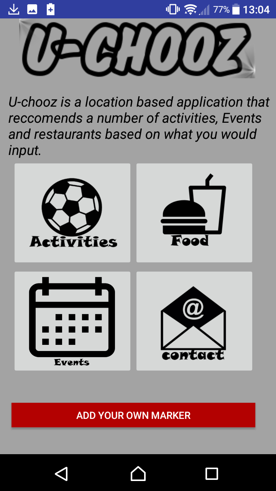

Current location

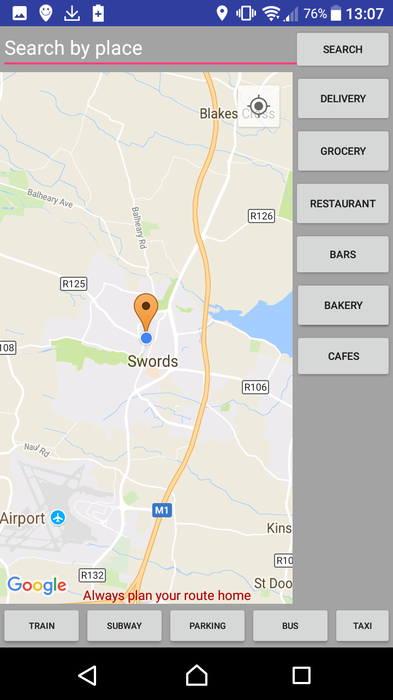

Activities page

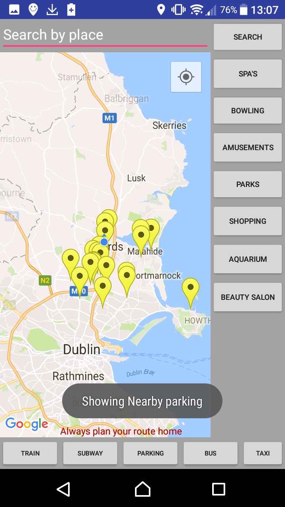

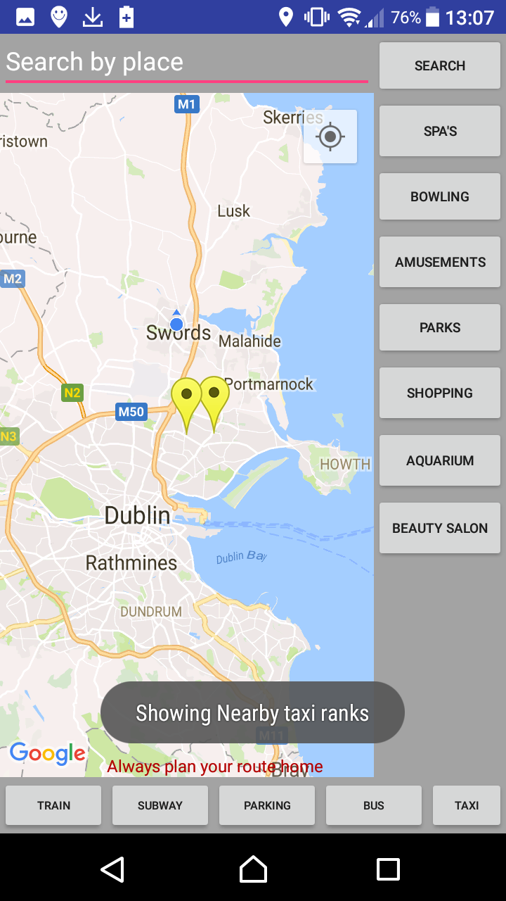

Food page

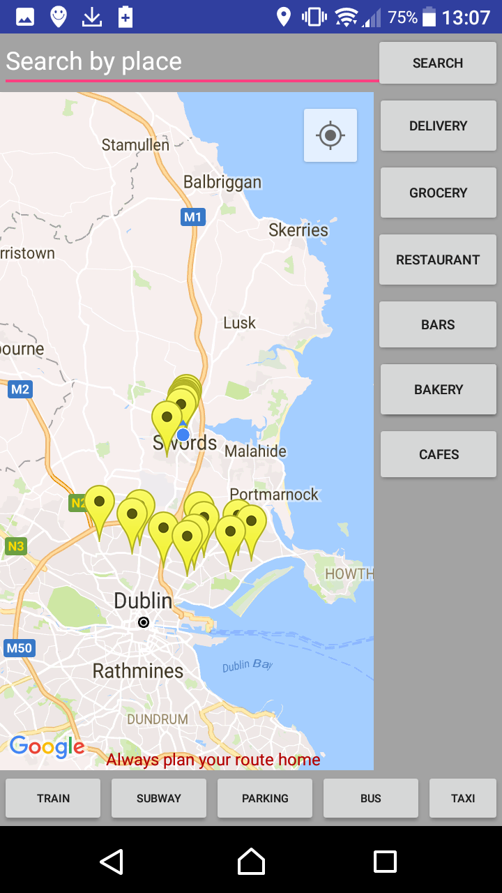
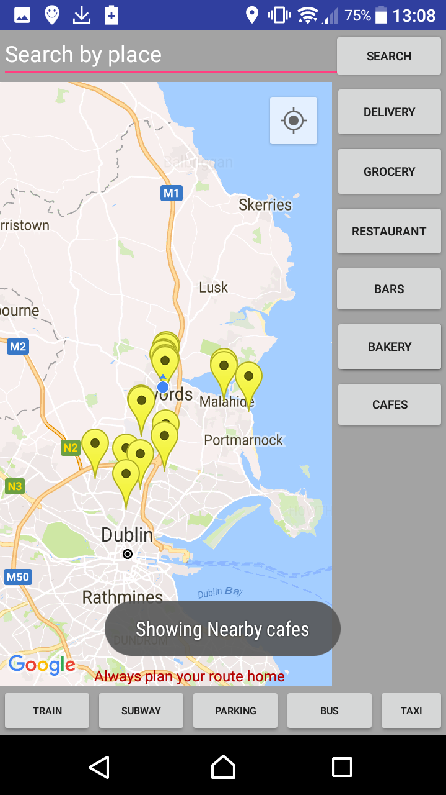
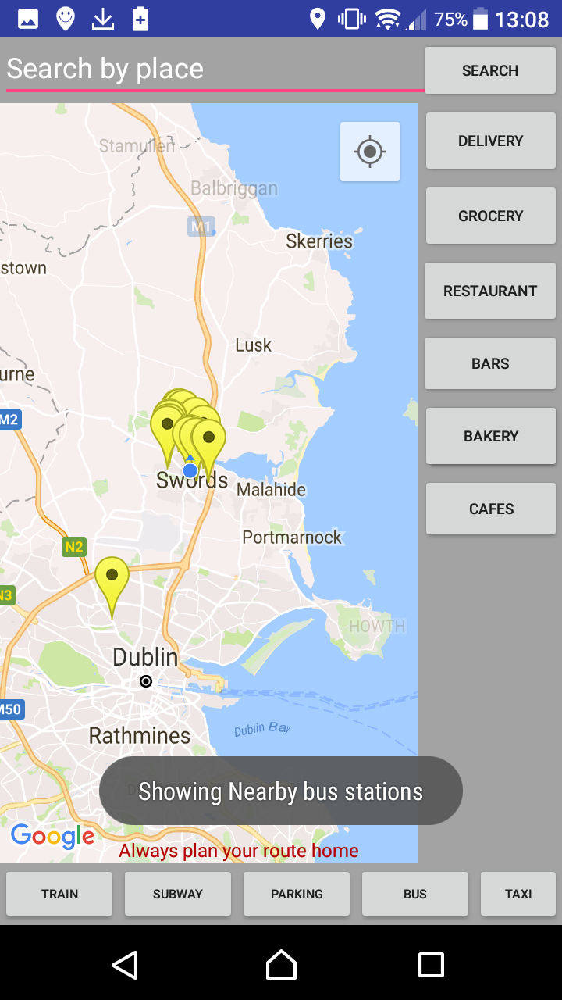
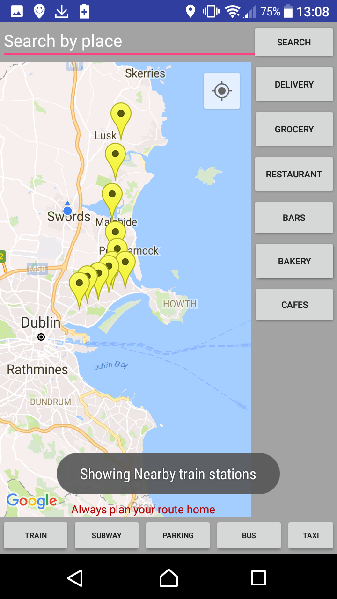

Events Page

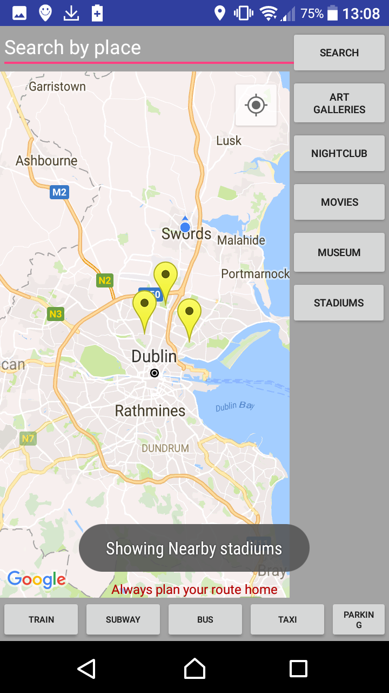

Add marker test

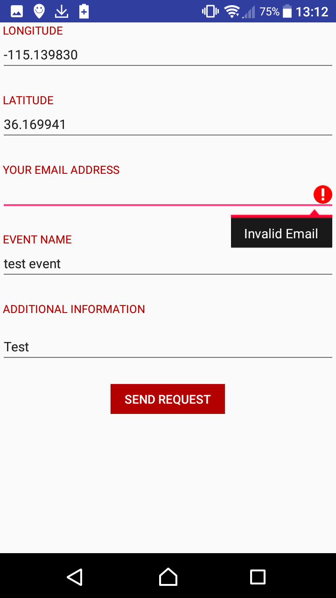
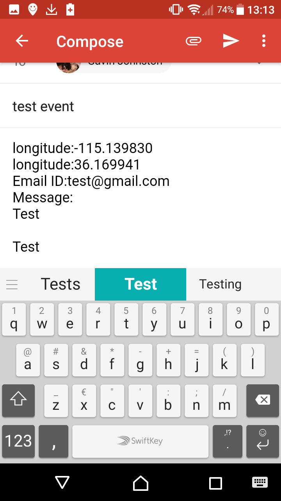

Contact test

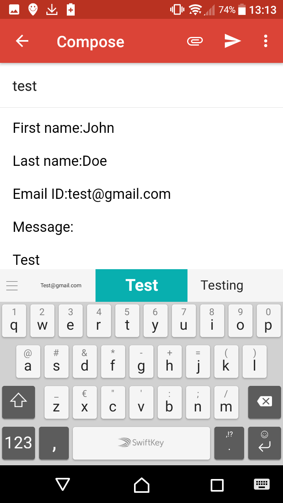
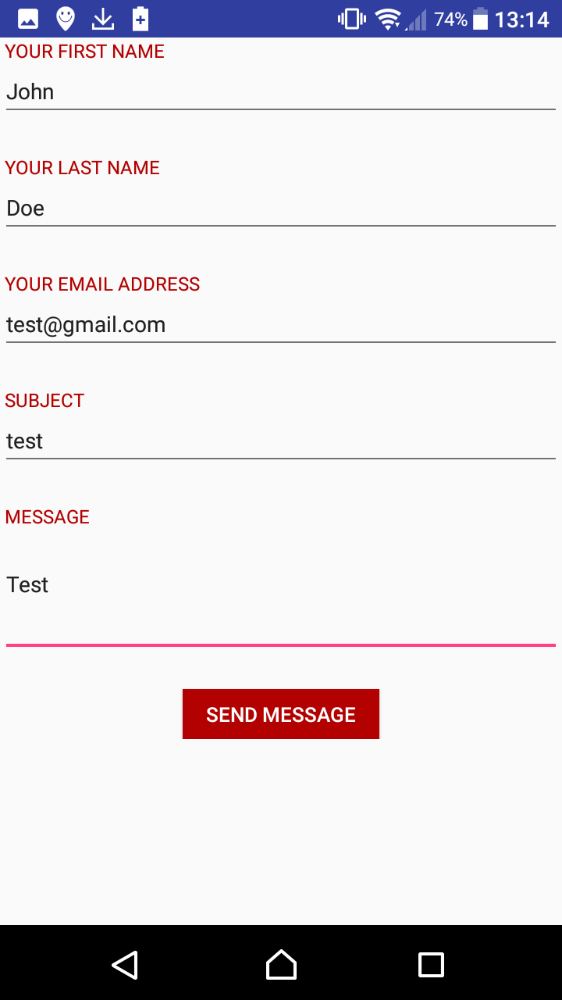
